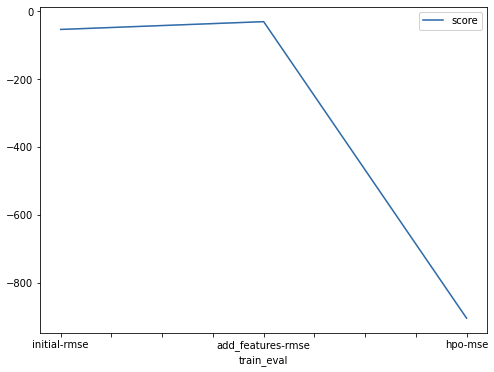
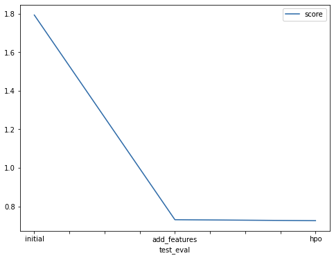

# Report: Predict Bike Sharing Demand with AutoGluon Solution
#### Christopher Deodat

## Initial Training
### What did you realize when you tried to submit your predictions? What changes were needed to the output of the predictor to submit your results?
Submitting the predictions will result in 'error' status when predicted bike share demand value is at negative. As there cannot be negative demand of bike shares at any time of day, the value must be changed to a minimum of 0.

### What was the top ranked model that performed?
The top ranked model that performed in the initial training as our baseline model is 'WeightedEnsemble_L3' with a score value of -53.091652 using 'root_mean_squared_error' evaluation metric.

## Exploratory data analysis and feature creation
### What did the exploratory analysis find and how did you add additional features?
Exploratory data analysis found out that the datetime column have all the information of hour, day, month, year combined. New features can be extracted from this column and using 'dt' function, they are extracted to each of their respective columns.

### How much better did your model preform after adding additional features and why do you think that is?
After adding additional features by extracting the date time, the model performed much better from the baseline model. Baseline model received an initial score of 1.79375 while the model with additional features increased the score to 0.73070. From the dataset given, it can be seen that the model is expected to predict the demand of bike sharing every hour. There are a lot of factors that can affect the hour, such as the day, month, year, season, weather, and temperature. Extracting the date time will help the model to associate these features with one another and gives better results.

## Hyper parameter tuning
### How much better did your model preform after trying different hyper parameters?
The new model performs a bit better by 0.005 after changing evaluation metric from 'root_mean_squared_error' to 'mean_squared_error'. This change in evaluation metric changes how the models will determine their selection and in turn, changes their prediction of the demand. But, due to a relatively small increase in score, this might be to the randomness of AutoGluon's TabularPredictor and needs more different submissions to verify

### If you were given more time with this dataset, where do you think you would spend more time?
I would try out new features in EDA. For example, in the dataset, weather is still labelled by 1,2,3 and 4. Switching this to one hot encode might get better results. Next, there are also the registered and casual column which in my exploratory i found out that they add up to the count. It might be worthwhile to explore the possibility of making 2 different models and sum up the results, one to predict casual demand, and the other to predict registered demand. Last there are multiple other hyperparameter evaluation metrics such as 'mean_absolute_error', 'median_absolute_error', 'mean_absolute_percentage_error', 'r2', and adjusting time limit that hasn't been explored yet.

### Create a table with the models you ran, the hyperparameters modified, and the kaggle score.
|model|eval_metric|time_limit|presets|score|
|--|--|--|--|--|
|initial|root_mean_squared_error|600|best_quality|1.79375|
|add_features|root_mean_squared_error|600|best_quality|0.73070|
|hpo|mean_squared_error|600|best_quality|0.72574|

### Create a line plot showing the top model score for the three (or more) training runs during the project.

### Create a line plot showing the top kaggle score for the three (or more) prediction submissions during the project.

## Summary
Predicting bike sharing demand using hyperparameters of root_mean_squared_error evaluluation metric, 600 seconds time limit, and using best_quality presets resulted in 1.79375 kaggle score which was used as the baseline in this project. In exploratory data analysis, the datetime feature is extracted to year, month, day, and hours to help the model better associate with other categorical/non-categorical features; weather, season, temperature, working day, humidity, and wind speed. With the new extracted features, the new model received a kaggle score of 0.73070, a significant increase from the baseline model. Hyperparameter tuning was also done by changing the evaluation metric to mean_squared_error. This changes how the model determine the demand count and the new hyperparameter tuned model received a kaggle score of 0.72574, slightly increased from the new features model. From this, it can be concluded that there are a lots of combinations to try out, while a big increase in model score resulted from EDA by having better data/feature engineered for the model to train with. 
